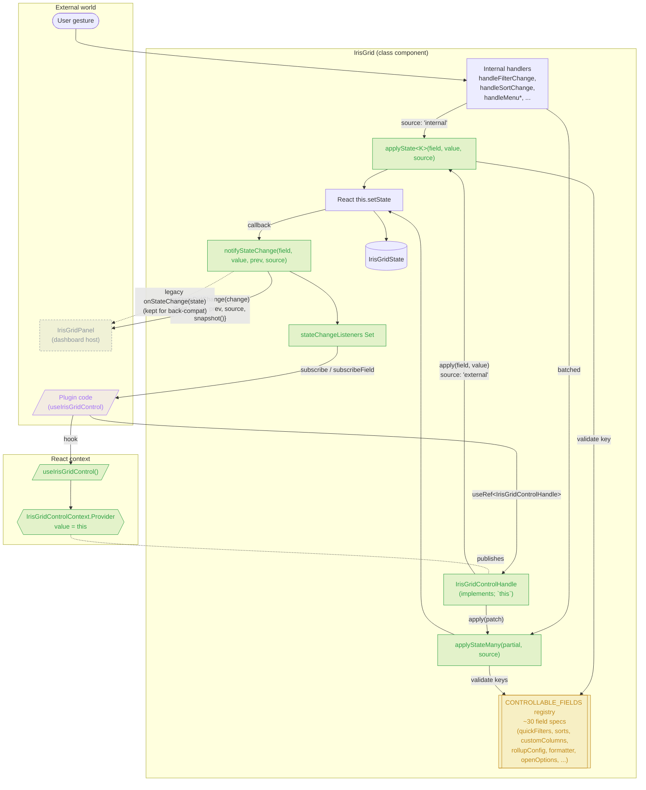

# DH-21476 — IrisGrid Architecture (branch `vlad-DH-21476-o4.7`)

Visual summary of what landed on this branch:

- **Phase 0** — controllable-field registry, canonical `applyState` pipe,
  granular `onStateDidChange`, `IrisGridControlContext` (the
  `IrisGrid` instance is itself the `IrisGridControlHandle`).
- **Phase 0.1** — handler migration: every internal `setState` for a
  registered field now goes through `applyState` / `applyStateMany`.
- **Phase 6 (in progress)** — `sidebarItems` transform prop +
  `OptionItem.configPage` + `PluginSidebarErrorBoundary` for plugin-
  supplied Table Options pages.

See [DH-21476-01-phase-0-foundation.md](DH-21476-01-phase-0-foundation.md)
and [DH-21476-06-shortest-path-customizable-table-options.md](DH-21476-06-shortest-path-customizable-table-options.md)
for the prose specs.

---

## Write/notify pipeline + control surface

**Key invariants enforced on this branch:**

- Every mutation of a *registered* `IrisGridState` field flows through
  `applyState` / `applyStateMany` — direct `this.setState` for
  registered keys is a code-review smell.
- `notifyStateChange` is the **only** emitter; it fires both
  `props.onStateDidChange` and the in-process subscriber set, so
  context consumers and the dashboard panel see identical events.
- `source` is `'internal'` for user gestures and `'external'` for
  writes coming through `IrisGridControlHandle.apply`, letting
  consumers distinguish their own writes without snapshot diffing.
- The class itself implements the handle interface — no
  `forwardRef` / `useImperativeHandle` wrapper. Ref ergonomics rely
  on covariant `RefObject<T>`, so both `useRef<IrisGrid>` and
  `useRef<IrisGridControlHandle>` work.
